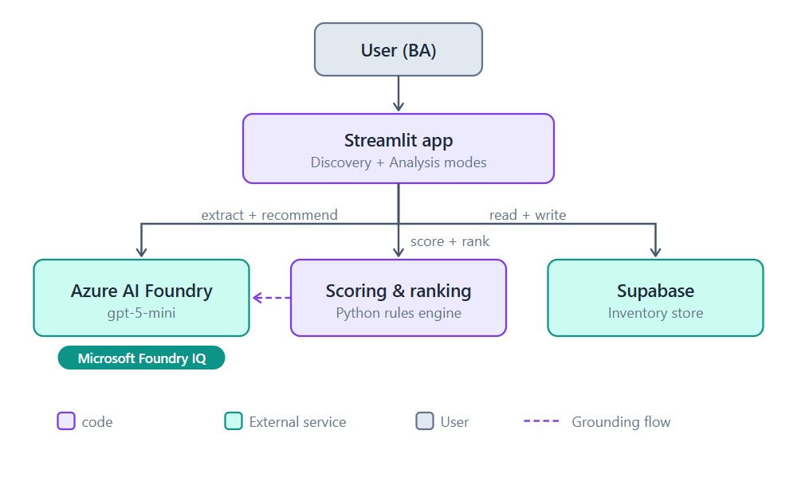

# Automation Scout 🔍

An AI agent that finds where a team should automate next. Describe a process you
suspect is wasteful and the Scout scores its automation potential, builds a
ranked inventory, and explains in plain language which work to automate first
and why.

Built for the **Microsoft Agents League** hackathon, **Creative Apps** track,
with AI-assisted development using **GitHub Copilot**.

## What it does

- **Discovery mode**: describe a process. The Scout asks for the details that
  matter (frequency, manual effort, people involved, tools used) and scores its
  automation potential.
- **Analysis mode**: see the ranked inventory and pull a grounded recommendation
  for the top candidates, each one citing the scoring numbers it's based on.

Conversational extraction and narrative recommendations run on Azure AI Foundry
(gpt-5-mini). The rule-based scoring engine works independently, so the app
still runs and ranks without the LLM configured.

## How the score works

Automation potential weighs monthly hours recoverable (frequency × time ×
% manual), integration friction (number of tools), and coordination cost
(people involved), with a penalty for work that needs human judgment — because
judgment-heavy work is a poor automation target. The formula is intentionally
simple so the agent can always explain *why* it ranked something.

## What grounded means here

The Foundry recommendations don't freelance. The scoring engine's structured
output (automation score, breakdown components, rank position in the inventory)
is passed to the model as evidence, and the system prompt tells it to cite that
evidence in its reasoning. The recommendation reads as analysis of the scoring
data with specific numbers from the breakdown. This is how Microsoft Foundry IQ
is integrated in the app.

## Run locally

```bash
pip install -r requirements.txt
python -m streamlit run app.py
```

Open the Local URL it prints (usually http://localhost:8501).

The scoring engine runs with no configuration. For the LLM features and
persistent storage, add this to `.streamlit/secrets.toml`:

```toml
AZURE_FOUNDRY_BASE_URL = "https://<your-resource>.services.ai.azure.com/openai/v1/"
AZURE_FOUNDRY_KEY = "<your-key>"
AZURE_FOUNDRY_DEPLOYMENT = "<your-deployment-name>"

SUPABASE_URL = "<your-supabase-url>"
SUPABASE_KEY = "<your-supabase-anon-key>"
```

Without Supabase, the inventory falls back to session state.

## Deploy

Push to a public GitHub repo and deploy free on Streamlit Community Cloud
(share.streamlit.io) — point it at this repo and `app.py`. Add the same
secrets under Settings → Secrets.

## Tech

Python · Streamlit · Azure AI Foundry (gpt-5-mini) · Supabase · built with
GitHub Copilot.

## Built with GitHub Copilot

Copilot was used throughout the build. A few places where it earned its keep:

- Scaffolding the scoring function from a verbal description of what the score
  should weigh, including the judgment penalty branch.
- The "list-then-count" prompt for tool extraction. Asking the model to list
  every tool before counting was a Copilot-suggested pattern that cut
  miscounting on ambiguous descriptions.
- The Foundry migration from GitHub Models. The endpoint variants
  (project-scoped vs. resource-scoped) and gpt-5-mini's stricter parameter
  surface produced a chain of 401 and 400 errors. Copilot pattern-matched the
  error strings to the right docs faster than reading documentation top to
  bottom.

## Roadmap

- Phase 2: connect to Microsoft Graph to discover repetitive work automatically
  from email and Teams patterns instead of a manually maintained inventory.

## Architecture


